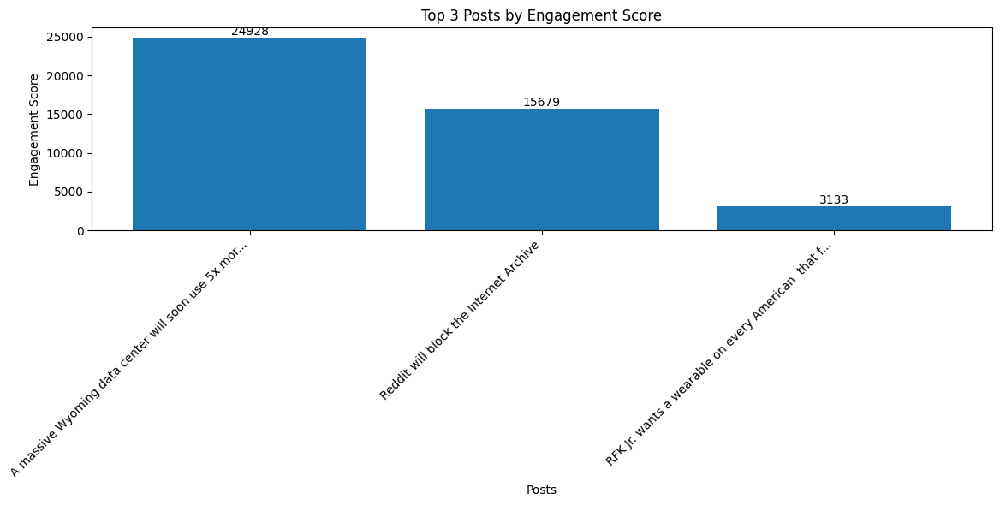

# Building a Scalable Data Pipeline for Reddit Data using PySpark and Databricks

This project builds a scalable data pipeline using PySpark and Databricks to collect, process, and analyze Reddit data.  
It extracts posts and their comments from technology subreddit via the Reddit API, cleans and transforms the data, and loads it into Databricks for further analysis.

## Features
- Extract Reddit posts and comments using the Reddit API
- Process and clean data with PySpark
- Store processed data in Databricks
- Perform exploratory data analysis (EDA) on the collected data

## Technologies Used
- Python
- Pandas
- PySpark
- Databricks
- Reddit API (PRAW)
- Git

## Pipeline Architecture

**1- Data Extraction (Local)**

  - Connects to Reddit API via PRAW.
  - Retrieves posts and comments from the technology subreddit.
  - Saves raw data as CSV files.

**2- Data Profiling & Cleaning (Local)**

  - Profiles the raw dataset.
  - Removes null values.
  - Formats text fields.

**3- Bronze Layer (Databricks)**

  - Reads CSV files into Databricks.

**4- Silver Layer (Databricks)**

- Converts created_utc timestamps to human-readable datetime format.

**5- Gold Layer (Databricks)**

  - Performs aggregations for key metrics.

**6- Exploratory Data Analysis (EDA)**

  - Generates charts for insights.

## How to Run

**1- Set up Reddit API Credentials**

  - Create a Reddit application at Reddit Developer Portal.
  - Add the credentials to a .env file:
    - CLIENT_ID=your_client_id
    - CLIENT_SECRET=your_client_secret
    - USER_AGENT=your_user_agent
    
**2- Run "reddit_data_ingestion_script.py"**
   - Connects to the Reddit API via PRAW.
   - Retrieves the top 10 hot posts from the technology subreddit along with their comments.
   - Saves the data into two separate CSV files:
        - reddit_posts.csv: containing the posts
        - reddit_comments.csv: containing the related comments

**3- Run "profiling and cleaning.py"**
   - Loads both posts.csv and comments.csv.
   - Profiles each file.
   - Applies simple cleaning operations:
        - Removal of null values
        - Formatting of text fields
          
**4- Databricks pipeline**
   The pipeline follows a Bronze–Silver–Gold architecture:
   - Bronze Layer (Bronze.ipynb):
      - Reads the cleaned CSV files (cleaned_posts.csv and cleaned_comments.csv) into Databricks as raw tables.
   - Silver Layer (Silver.ipynb):
      - Converts created_utc field from UNIX timestamp to human-readable datetime format.
        
   - Gold Layer (Gold.ipynb):
        Performs aggregations and prepares analytical datasets for visualization:
        - Top 3 Posts by Engagement (sorted by score)
        - Correlation analysis between top post scores and the average scores of their comments (to explore whether highly-rated posts also tend to have highly-rated comments).
        - Top 5 commenters
     
  - Exploratory Data Analysis (EDA) & Visualizations:
          is performed on the Gold layer datasets to extract insights.
    
     **Generated visualizations include:**
             
             
             

            
